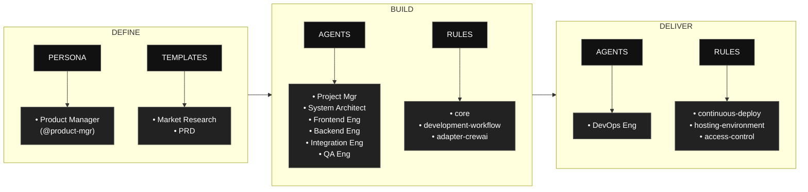

# AAMAD – AI-Assisted Multi-Agent Application Development Framework

**AAMAD** is an open, production-grade framework for building, deploying, and evolving multi-agent applications using best context engineering practices.
It systematizes research-driven planning, modular AI agent workflows, and rapid MVP/devops pipelines for enterprise-ready AI solutions.

---

## Architecture Highlights

- **Multi-agent orchestration with CrewAI** — specialized agents (Classifier, Sentiment, Knowledge, Response, Escalation) coordinated by a Manager agent via hierarchical process
- **Hybrid deterministic + LLM execution pipeline** — runs zero-cost in deterministic mode by default; flip `USE_LLM=true` to enable full Claude-powered inference
- **Structured observability and tracing** — every tool call, LLM invocation, and agent step is recorded with latency, token counts, cost, and execution mode
- **Human-in-the-loop escalation workflows** — operator dashboard with approve / reject / await-customer actions and full audit trail
- **RAG with contextual document retrieval** — local keyword search across `knowledge/` files; upgradable to vector-based retrieval via `ENABLE_CREWAI_KNOWLEDGE=true`
- **Real-time analytics and KPI dashboard** — CSAT, ticket volume, sentiment distribution, urgency breakdown, timeline, and agent performance metrics
- **External API enrichment** — live address validation (ViaCEP, no key required) and weather-based delivery delay detection (OpenWeatherMap)
- **Token and cost tracking** — per-ticket input/output token counts and USD cost estimates surfaced in observability events and the analytics dashboard
- **Response caching and fallback handling** — tool-level caching via `ToolRegistry`; graceful degradation when APIs are unavailable
- **SQLite persistence layer** — full SQLAlchemy ORM with automatic schema creation; PostgreSQL-ready via `DATABASE_PROVIDER=postgres`
- **Operator review dashboard** — dedicated view for escalated tickets with inline detail, timeline, knowledge sources, and one-click resolution actions

---

## Quick Start: CrewAI Support System

AAMAD includes a complete customer support system powered by CrewAI with hierarchical agent orchestration. The system uses multiple specialized agents working together under a manager agent to handle customer inquiries.

### Running the Support System

1. **Install dependencies:**
   ```bash
   pip install -e .
   ```

2. **Set up environment variables:**
   ```bash
   cp .env.example .env
   # Edit .env with your GOOGLE_API_KEY (optional, system works deterministically without it)
   ```

3. **Configure feature flags (optional):**
   ```bash
   # In .env or environment variables
   USE_LLM=false                    # Keep deterministic (default)
   ENABLE_MEMORY=false              # Enable conversation memory (default: false)
   ENABLE_CREWAI_KNOWLEDGE=false    # Use local knowledge files (default: false)
   ENABLE_PROMPT_TEMPLATES=true     # Use prompt templates (default: true)
   ```

4. **Start the backend:**
   ```bash
   python -m src.aamad.backend
   ```

5. **Launch the frontend:**
   ```bash
   streamlit run src/aamad/streamlit_app.py
   ```

### Architecture: CrewAI-Inspired Multi-Agent System

The support system implements a **CrewAI-inspired architecture** with modular components:

#### Core Components

- **`tools/` folder**: Modular tool implementations replacing inline tool classes
  - `ClassificationTool`: Categorizes customer inquiries
  - `SentimentTool`: Analyzes emotional tone and urgency
  - `KnowledgeTool`: Retrieves relevant support articles
  - `ResponseTool`: Generates contextual responses
  - `EscalationTool`: Determines escalation needs
  - `MemoryTool`: Manages conversation memory
  - `PromptTool`: Handles prompt template management

- **`skills/` folder**: Reusable skill definitions for agent capabilities
  - `customer_support_analysis.md`: Core support skills
  - `escalation_decision.md`: Escalation guidelines
  - `empathetic_response.md`: Response quality standards
  - `safety_validation.md`: Content safety checks
  - `multilingual_support.md`: Language handling
  - `safety_validation.md`: Content safety checks

- **`tool_registry.py`**: Central tool execution governance
  - Tool registration and discovery
  - Execution caching and performance monitoring
  - Governance checks (allowlist/blocklist)
  - Error handling and logging

- **`services/` folder**: Service layer for cross-cutting concerns
  - `KnowledgeService`: Local knowledge base management
  - `MemoryService`: Conversation persistence
  - `PromptService`: Template management
  - `SkillService`: Agent skill validation

#### New Response Fields (Week 4)

The API now returns additional observability and integration fields:

```json
{
  "tools_used": ["Classification Tool", "Sentiment Analysis Tool", ...],
  "skills_used": ["customer_support_analysis", "empathetic_response"],
  "cache_used": true,
  "execution_mode": "deterministic"
}
```

#### Feature Flags (Week 4)

Control system behavior with environment variables:

```bash
USE_LLM=false                    # Deterministic mode (default)
ENABLE_MEMORY=false              # Conversation memory (default: false)
ENABLE_CREWAI_KNOWLEDGE=false    # Local knowledge files (default: false)
ENABLE_PROMPT_TEMPLATES=true     # Template-based responses (default: true)
ENABLE_MCP=false                 # Model Context Protocol (future)
ENABLE_EXTERNAL_APIS=false       # Real external APIs (default: false)
ENABLE_MOCK_INTEGRATIONS=true    # Mock integrations (default: true)
```

### Full-Stack Integration (Week 4)

The system now provides complete HTTP API integration between Streamlit frontend and FastAPI backend:

#### API Endpoints

- `POST /api/support` → Submit inquiry and process request
- `GET /api/support/{reference_id}/status` → Return processing/escalation status
- `GET /api/support/{reference_id}/steps` → Return agent/tool execution steps
- `POST /api/support/{reference_id}/feedback` → Submit user feedback
- `POST /api/support/{reference_id}/approve` → Approve escalated ticket
- `POST /api/support/{reference_id}/reject` → Reject ticket (request revision)
- `GET /api/health` → Health check

#### Human-in-the-Loop Feedback

The frontend now includes feedback mechanisms:
- 👍 Helpful / 👎 Not Helpful buttons
- 🔄 Request Revision for automated responses
- Approve/Reject actions for escalated tickets
- Audit trail showing submission → processing → escalation/automation → feedback

#### Mock External Integrations (Week 4)

Created `integrations/` folder with mock clients ready for real API integration:

- **`ticketing_client.py`**: External support ticket system
- **`crm_client.py`**: Customer Relationship Management
- **`notification_client.py`**: Email/SMS notifications

All integrations include:
- REST client patterns with timeout/retry placeholders
- Secure auth placeholders for API keys
- Rate limiting placeholders
- Error handling and logging

Enable real integrations by setting:
```bash
ENABLE_EXTERNAL_APIS=true
ENABLE_MOCK_INTEGRATIONS=false
```

#### External API Integration Tools (Week 4 Enhancement)

The system now includes generic and specialized API integration tools ready for production use:

##### Generic API Tools
- **`RESTApiTool`**: Generic REST API client with retry, timeout, and rate limiting
- **`GraphQLApiTool`**: GraphQL API client with query/mutation support

##### Specialized API Tools
- **`WeatherTool`**: Weather data integration (OpenWeatherMap, etc.)
- **`GitHubTool`**: GitHub repository and user data integration
- **`AddressValidationTool`**: Brazilian CEP validation via ViaCEP (real API, no key required)
- **`WeatherCheckTool`**: Live weather for delivery delay detection via OpenWeatherMap

## Environment Variables

| Variable | Required | Description |
|---|---|---|
| ANTHROPIC_API_KEY | Yes | Claude AI API key |
| INTERNAL_API_KEY | Yes | Operator dashboard auth |
| OPENWEATHER_API_KEY | Yes | Weather check tool (free tier: 1000 calls/day) |
| ALLOWED_ORIGINS | No | CORS origins (default: localhost) |
| MAX_KNOWLEDGE_SNIPPETS | No | RAG snippet limit (default: 3) |
| MAX_SNIPPET_CHARS | No | Snippet size limit (default: 800) |
| USE_LLM | No | Enable LLM mode (default: True) |
| CREWAI_VERBOSE | No | Verbose agent logs (default: false) |

##### Configuration
```bash
# Database (PostgreSQL-ready with SQLite fallback)
DATABASE_PROVIDER=sqlite  # or postgres
DATABASE_URL=sqlite:///src/aamad/data/tickets.db

# Redis (optional caching)
ENABLE_REDIS_CACHE=false
REDIS_URL=redis://localhost:6379

# API Authentication (secure placeholders)
EXTERNAL_API_KEY=your_api_key_here
GITHUB_TOKEN=your_github_token_here
WEATHER_API_KEY=your_weather_api_key_here
OAUTH_CLIENT_ID=your_oauth_client_id
OAUTH_CLIENT_SECRET=your_oauth_client_secret

# Integration Settings
INTEGRATION_RETRY_COUNT=3
INTEGRATION_TIMEOUT_SECONDS=30
INTEGRATION_RATE_LIMIT_PER_MINUTE=60
```

##### Integration Logging
All API integrations log attempts with structured data:
```json
{
  "integration_name": "weather_api",
  "mode": "mock",
  "latency": 0.234,
  "status": "success",
  "error": null
}
```

##### Database Abstraction
- **SQLite fallback**: JSON file-based storage (default)
- **PostgreSQL ready**: Full SQLAlchemy ORM support
- **Automatic migration**: Schema created on startup
- **Zero breaking changes**: Existing JSON storage preserved

#### Data Persistence

Lightweight JSON-based persistence for:
- Support tickets with full audit trail
- Feedback and approval status
- Timestamps and execution metadata
- Located in `src/aamad/data/tickets.json`

### How It Works

The system uses **hierarchical process** with these agents:

- **Manager Agent**: Coordinates the entire support process, delegates tasks, and ensures quality
- **Classifier Agent**: Categorizes inquiries (Order Issues, Billing, Account Access, Technical Issues, General Support)
- **Sentiment Agent**: Analyzes emotional tone and urgency levels
- **Knowledge Agent**: Retrieves relevant support articles from local knowledge base
- **Response Agent**: Generates helpful, contextual responses
- **Escalation Agent**: Determines when human intervention is needed

Tasks run in a coordinated workflow where the manager oversees execution and can dynamically adjust based on results.

#### Current Mode: Deterministic (Zero-Cost)

The system currently operates in **deterministic mode** with no LLM calls required:
- **Knowledge**: Local keyword search in `knowledge/` folder files
- **Memory**: Optional local storage in JSON format
- **Prompts**: Template-based responses ready for future LLM integration
- **No API keys required** for basic functionality

#### Future-Ready Architecture

The system is designed to seamlessly transition to LLM-powered mode:
- Set `USE_LLM=true` to enable CrewAI LLM agents
- Set `ENABLE_CREWAI_KNOWLEDGE=true` for vector-based knowledge retrieval
- Set `ENABLE_MEMORY=true` for persistent conversation memory
- All prompt templates are prepared in the `prompts/` folder

### Testing New Features

#### Test Knowledge Retrieval
```bash
# Test local knowledge search
curl -X POST "http://localhost:8000/api/support" \
  -H "Content-Type: application/json" \
  -d '{"inquiry": "How do I get a refund for my order?"}'
```
Check response for `knowledge_source: "local_files"` and relevant articles.

#### Test Memory (when enabled)
```bash
# Enable memory in environment
export ENABLE_MEMORY=true

# Make a request
curl -X POST "http://localhost:8000/api/support" \
  -H "Content-Type: application/json" \
  -d '{"inquiry": "My order is delayed"}'

# Check memory.json file is created/updated
cat memory.json
```

#### Test Prompt Templates
Prompt templates are loaded from `prompts/` folder and can be inspected in logs.

#### Verify Deterministic Mode
- No API keys required
- System responds instantly
- Check `execution_mode: "deterministic"` in response

---

## Table of Contents

- [What is AAMAD?](#what-is-aamad)
- [AAMAD phases at a glance](#aamad-phases-at-a-glance)
- [Installation](#installation)
- [Using AAMAD in your IDE](#using-aamad-in-your-ide)
- [Repository Structure](#repository-structure)
- [How to Use the Framework](#how-to-use-the-framework)
- [Phase 1: Define Workflow (Product Manager)](#phase-1-define-workflow-product-manager)
- [Phase 2: Build Workflow (Multi-Agent)](#phase-2-build-workflow-multi-agent)
- [Core Concepts](#core-concepts)
- [Contributing](#contributing)
- [License](#license)

---

## Repository Structure

```
AAMAD/
├── CHANGELOG.md
├── CHECKLIST.md
├── LICENSE
├── main.py
├── pyproject.toml
├── README.md
├── .env.example              # Environment variables template
├── config/
│   ├── agents.yaml          # Agent configurations
│   └── tasks.yaml           # Task definitions
├── knowledge/               # Local knowledge base files
├── memory.json              # Conversation memory (when enabled)
├── prompts/                 # Prompt templates
├── project-context/         # AAMAD framework artifacts
│   ├── 1.define/
│   │   ├── mrd.md          # Market Research Document
│   │   └── prd.md          # Product Requirements Document
│   ├── 2.build/
│   │   └── sad.md          # System Architecture Document
│   └── 3.deliver/
├── scripts/
│   └── update_bundle.py     # Bundle update script
├── skills/                  # Agent skill definitions
│   ├── customer_support_analysis.md
│   ├── escalation_decision.md
│   ├── empathetic_response.md
│   ├── multilingual_support.md
│   └── safety_validation.md
├── src/aamad/
│   ├── __init__.py
│   ├── backend.py           # FastAPI backend with CrewAI flow
│   ├── cli.py               # Command-line interface
│   ├── claude_code.py       # Claude Code integration
│   ├── config.py            # Configuration and constants
│   ├── data_store.py        # Data persistence layer
│   ├── frontend.py          # Streamlit frontend
│   ├── installer.py         # Installation utilities
│   ├── services.py          # Service layer (knowledge, memory, prompts, skills)
│   ├── streamlit_app.py     # Streamlit UI application
│   ├── tool_registry.py     # Tool execution governance
│   ├── vscode_copilot.py    # VS Code + Copilot integration
│   ├── data/                # Data storage directory
│   │   └── tickets.json     # JSON ticket storage
│   └── integrations/        # External API integrations
│       ├── ticketing_client.py
│       ├── crm_client.py
│       └── notification_client.py
├── tools/                   # Modular tool implementations
│   ├── __init__.py
│   ├── classification_tool.py
│   ├── escalation_tool.py
│   ├── github_tool.py       # GitHub API integration
│   ├── graphql_api_tool.py  # GraphQL API client
│   ├── knowledge_tool.py
│   ├── memory_tool.py
│   ├── prompt_tool.py
│   ├── response_tool.py
│   ├── rest_api_tool.py     # REST API client
│   ├── sentiment_tool.py
│   └── weather_tool.py      # Weather API integration
├── tests/
│   ├── test_backend.py      # Backend unit tests
│   ├── test_claude_code.py
│   ├── test_frontend.py
│   ├── test_streamlit_app.py
│   └── test_vscode_copilot.py
└── aamad.egg-info/
```

AAMAD is a context engineering framework based on best practices in AI-assisted coding and multi-agent system development methodologies.  
It enables teams to:

- Launch projects with autonomous or collaborative AI agents
- Rapidly prototype MVPs with clear context boundaries
- Use production-ready architecture/design patterns
- Accelerate delivery, reduce manual overhead, and enable continuous iteration

---

## AAMAD phases at a glance

AAMAD organizes work into three phases: Define, Build, and Deliver, each with clear artifacts, personas, and rules to keep development auditable and reusable. 
The flow begins by defining context and templates, proceeds through multi‑agent build execution, and finishes with operational delivery.



- **Phase 1 (Define):** Product Manager persona (`@product-mgr`) conducts prompt-driven discovery and context setup, supported by templates for Market Research Document (MRD) and Product Requirements Document (PRD), to standardize project scoping.

- **Phase 2 (Build):** Multi‑agent execution by Project Manager, System Architect, Frontend Engineer, Backend Engineer, Integration Engineer, and QA Engineer, governed by core, development‑workflow, and CrewAI‑specific rules.

- **Phase 3 (Deliver):** DevOps Engineer focuses on release and runtime concerns using rules for continuous deployment, hosting environment definitions, and access control.

---

## Installation

Install AAMAD from PyPI and initialize the framework for your IDE:

```bash
pip install aamad
# or
uv pip install aamad
```

### Multi-IDE support

AAMAD supports **Cursor**, **Claude Code**, and **VS Code + GitHub Copilot**. Choose your IDE with the `--ide` flag:

```bash
aamad init --ide cursor        # Default: Cursor
aamad init --ide claude-code  # Claude Code
aamad init --ide vscode       # VS Code + GitHub Copilot
```

### Frontend CLI Demo

You can also run a simple customer support frontend from the package:

```bash
python -m aamad.frontend
# or, if installed as a script:
aamad-support
```

### Web UI Demo (Streamlit)

If you want to see the UI in the browser, install Streamlit and run:

```bash
pip install streamlit
PYTHONPATH=src python -m streamlit run src/aamad/streamlit_app.py
# or, if installed as a script:
aamad-ui
```

### Backend API (FastAPI)

To run the backend support crew, install the backend dependencies and start the server:

```bash
pip install fastapi uvicorn
PYTHONPATH=src python -m aamad.backend
# or, if installed as a script:
aamad-backend
```

The Streamlit UI will attempt to call the backend at `http://127.0.0.1:8000/api/support`; if the backend is not available, it falls back to local processing.


#### Framework feature implementation by IDE

| Feature | Cursor | Claude Code | VS Code + Copilot |
| :------ | :----- | :---------- | :---------------- |
| **Rules / instructions** | `.cursor/rules/*.mdc` with `alwaysApply: true` | `.claude/CLAUDE.md` + `.claude/rules/*.md` | `.github/instructions/*.instructions.md` |
| **Rule format** | `.mdc` (YAML frontmatter + markdown body) | `.md` (plain markdown) | `.instructions.md` (`applyTo`, `name`, `description`) |
| **Glob-based scoping** | ✅ `globs:` in frontmatter | ❌ Not supported (all rules loaded) | ✅ `applyTo:` in frontmatter |
| **Agent definitions** | `.cursor/agents/*.md` | `.claude/agents/*.md` | `.github/agents/*.agent.md` |
| **Agent invocation** | `@agent-name` in chat | Delegation via `description`; explicit request | Agent dropdown; `@agent-name`; handoff buttons |
| **Tool enforcement** | Instructions-based | ✅ Hard allowlist/denylist | ✅ Tool allowlist in frontmatter |
| **Phase 1 prompt** | `.cursor/prompts/prompt-phase-1` | `.claude/commands/phase-1-define.md` (slash command) | `.github/prompts/phase-1-define.prompt.md` |
| **Templates** | `.cursor/templates/` (shared) | `.cursor/templates/` (shared) | `.cursor/templates/` (shared) |
| **Project context** | `project-context/` (shared) | `project-context/` (shared) | `project-context/` (shared) |
| **Bridge file** | `AGENTS.md` (root) | `AGENTS.md` (root) | `AGENTS.md` (root) |

---

### Cursor

**Install and initialize:**

```bash
python -m venv .venv
source .venv/bin/activate   # Windows: .venv\Scripts\activate
pip install aamad
aamad init --ide cursor --dest .
```

Or with uv:

```bash
uv venv
uv pip install aamad
uv run aamad init --ide cursor --dest .
```

**Folder structure after init:**

```
your-project/
├── .cursor/
│   ├── agents/          # Persona definitions (@product-mgr, @backend.eng, etc.)
│   ├── prompts/         # Phase-specific prompts (e.g. prompt-phase-1)
│   ├── rules/           # Always-on rules (*.mdc)
│   └── templates/      # PRD, SAD, MR templates
├── project-context/
│   ├── 1.define/        # MRD, PRD, SAD outputs
│   ├── 2.build/         # setup.md, frontend.md, backend.md, etc.
│   └── 3.deliver/       # QA logs, deploy configs
├── AGENTS.md            # Bridge file (IDE discoverability)
├── CHECKLIST.md
└── README.md
```

---

### Claude Code

**Install and initialize:**

```bash
python -m venv .venv
source .venv/bin/activate
pip install aamad
aamad init --ide claude-code --dest .
```

### Frontend CLI Demo

After installing the package, you can run the sample customer support frontend directly:

```bash
python -m aamad.frontend
# or, if installed with scripts:
aamad-support
```

Or with uv:

```bash
uv venv
uv pip install aamad
uv run aamad init --ide claude-code --dest .
```

**Folder structure after init:**

```
your-project/
├── .claude/
│   ├── CLAUDE.md        # Rules summary + cross-references
│   ├── agents/          # Persona definitions (Claude Code format)
│   ├── commands/        # Slash commands (e.g. phase-1-define)
│   ├── rules/           # Individual rule files (*.md)
│   └── settings.json    # Permissions, AAMAD_ADAPTER env
├── .cursor/
│   └── templates/       # PRD, SAD, MR templates (shared)
├── project-context/
│   ├── 1.define/
│   ├── 2.build/
│   └── 3.deliver/
├── AGENTS.md
├── CHECKLIST.md
└── README.md
```

---

### VS Code + GitHub Copilot

**Install and initialize:**

```bash
pip install aamad
aamad init --ide vscode --dest .
```

Or with uv:

```bash
uv pip install aamad
uv run aamad init --ide vscode --dest .
```

**Folder structure after init:**

```
your-project/
├── .github/
│   ├── instructions/   # Copilot instructions (*.instructions.md)
│   ├── agents/         # Custom agents (*.agent.md) with optional handoffs
│   └── prompts/        # Phase 1 prompt (phase-1-define.prompt.md)
├── .vscode/
│   └── settings.json   # chat.instructionsFilesLocations, chat.agentFilesLocations
├── .cursor/
│   └── templates/      # PRD, SAD, MR templates (shared)
├── project-context/
│   ├── 1.define/
│   ├── 2.build/
│   └── 3.deliver/
├── AGENTS.md
├── CHECKLIST.md
└── README.md
```

**Required extensions:** GitHub Copilot, GitHub Copilot Chat. Recommended: Python (ms-python), YAML (redhat).

---

### Using AAMAD in your IDE

How you interact with AAMAD depends on your IDE. The framework produces the same artifacts (`project-context/`, templates, Phase 1 prompt); only rules and agent scaffolding differ.

#### Workflow and context (per IDE)

| What you do | Cursor | Claude Code | VS Code + Copilot |
| :---------- | :----- | :---------- | :---------------- |
| **Start a fresh context** (e.g. new module) | `Cmd+Shift+P` → **New Chat** | `/clear` or start a new session | Start a new chat session |
| **Invoke a persona** | Type `@backend.eng` (or other agent) in chat | Ask to use the subagent by name, or refer to its description | Pick the agent from the dropdown, or use `@agent-name` |
| **Reference a file** | `@path/to/file` in chat | `@path/to/file` in the prompt | `#file:path/to/file` or drag-and-drop the file |
| **Phase transitions** (Define → Build → Deliver) | Switch persona manually in chat | Use subagent chaining or explicit instructions | Use **handoff** buttons in the chat UI (when configured) |

#### Capability comparison

| Capability | Cursor | Claude Code | VS Code + Copilot |
| :--------- | :----- | :---------- | :---------------- |
| **AAMAD support** | Native (default) | Via `aamad init --ide claude-code` | Via `aamad init --ide vscode` |
| **Glob-based rule scoping** | Yes | No (all rules loaded) | Yes (`applyTo:` in instructions) |
| **Tool enforcement** | Instructions only | Hard allowlist/denylist | Tool allowlist in agent frontmatter |
| **Agent handoffs** | Manual | Manual or subagent chaining | Native UI buttons (Define → Build → Deliver) |
| **Parallel work** | Multiple chat tabs | Subagents / Agent Teams | Subagents |
| **Model choice** | Multi-model | Claude models | Multi-model (GPT, Claude, Gemini, etc.) |
| **Best for** | AAMAD as designed | CLI-first, solo use | Teams, enterprise, model diversity |

#### What is the same in all IDEs

These are **IDE-agnostic** — no change when you switch:

- **`project-context/`** — Directory layout and all Phase 1/2/3 outputs (MRD, PRD, SAD, setup.md, frontend.md, backend.md, integration.md, qa.md).
- **Templates** — PRD, SAD, MR templates (in `.cursor/templates/`; shared across IDEs).
- **Phase 1 prompt** — Usable in any AI chat; same content in Cursor prompts, Claude Code commands, or VS Code prompts.
- **CrewAI code, YAML configs, Python** — All build and runtime logic.
- **Git and dependency setup** — Same repo and `pyproject.toml` workflow.

What **does** change per IDE: where rules and agents live (`.cursor/`, `.claude/`, or `.github/`) and how you invoke personas and reference files (see table above).

---

**CLI flags:**

- `--dest PATH` — Output directory (default: current directory)
- `--ide {cursor,claude-code,vscode}` — Target IDE (default: cursor)
- `--overwrite` — Allow replacing existing files
- `--dry-run` — Preview what would be written

Inspect bundle contents: `aamad bundle-info --verbose` or `aamad bundle-info --ide claude-code`. For `--ide vscode`, artifacts are generated from the Cursor bundle (no separate bundle).

---

## Repository Structure

    aamad/
    ├─ .cursor/
    │   ├─ agents/       # Agent persona definitions
    │   ├─ prompts/      # Phase-specific prompts
    │   ├─ rules/        # Architecture, workflow, epics rules
    │   └─ templates/    # PRD, SAD, MR templates
    ├─ project-context/
    │   ├─ 1.define/     # PRD, SAD, research reports
    │   ├─ 2.build/      # Setup, frontend, backend, integration, QA
    │   └─ 3.deliver/    # QA logs, deploy configs
    ├─ docs/
    ├─ CHECKLIST.md
    └─ README.md

**Framework artifacts** in `.cursor/` are the source for both Cursor and Claude Code bundles.  
**Project-context** is IDE-agnostic and shared across all IDEs.

---

## How to Use the Framework

1. **Install** (recommended): `pip install aamad` then `aamad init --ide <cursor|claude-code>`
2. **Or clone** this repository and copy `.cursor/` and `project-context/` into your project.
3. Confirm your IDE has the full agent, prompt, and rule set.
4. Follow `CHECKLIST.md` for the Define → Build → Deliver workflow.
5. Each agent persona executes its epic(s), producing markdown artifacts and code.
6. Review, test, and launch the MVP, then iterate.

---

## Phase 1: Define Stage (Product Manager)

The Product Manager persona (`@product-mgr`) conducts prompt-driven discovery and context setup to standardize project scoping:

- **Market Research:** Generate Market Research Document (MRD) using `.cursor/templates/mr-template.md`
- **Requirements:** Generate Product Requirements Document (PRD) using `.cursor/templates/prd-template.md`
- **Context Summary:** Create comprehensive context handoff artifacts for technical teams
- **Validation:** Ensure completeness of market analysis, user personas, feature requirements, and success metrics

Phase 1 outputs are stored in `project-context/1.define/` and provide the foundation for all subsequent development phases.

---

## Phase 2: Build Stage (Multi-Agent)

Each role is embodied by an agent persona, defined in `.cursor/agents/` (Cursor) or `.claude/agents/` (Claude Code).  
Phase 2 is executed by running each epic in sequence after completing Phase 1:

- **Architecture:** Generate solution architecture document (`sad.md`)
- **Setup:** Scaffold environment, install dependencies, and document (`setup.md`)
- **Frontend:** Build UI + placeholders, document (`frontend.md`)
- **Backend:** Implement backend, document (`backend.md`)
- **Integration:** Wire up chat flow, verify, document (`integration.md`)
- **Quality Assurance:** Test end-to-end, log results and limitations (`qa.md`)

Artifacts are versioned and stored in `project-context/2.build` for traceability.

---

## Core Concepts

- **Persona-driven development:** Each workflow is owned and documented by a clear AI agent persona with a single responsibility principle.
- **Context artifacts:** All major actions, decisions, and documentation are stored as markdown artifacts, ensuring explainability and reproducibility.
- **Parallelizable epics:** Big tasks are broken into epics, making development faster and more autonomous while retaining control over quality.
- **Reusability:** Framework reusable for any project—simply drop in your PRD/SAD and let the agents execute.
- **Open, transparent, and community-driven:** All patterns and artifacts are readable, auditable, and extendable.

---

## Contributing

Contributions are welcome!  
- Open an issue for bugs/feature ideas/improvements.
- Submit pull requests with extended templates, new agent personas, or bug fixes.
- Help evolve the knowledge base and documentation for greater adoption.
- When modifying `.cursor/` or `project-context/`, run `python scripts/update_bundle.py` to refresh both Cursor and Claude Code bundles before publishing.

---

## License

Licensed under Apache License 2.0.

> Why Apache-2.0
>    Explicit patent grant and patent retaliation protect maintainers and users from patent disputes, which is valuable for AI/ML methods, agent protocols, and orchestration logic.
>    Permissive terms enable proprietary or closed-source usage while requiring attribution and change notices, which encourages integration into enterprise stacks.
>    Compared to MIT/BSD, Apache-2.0 clarifies modification notices and patent rights, reducing legal ambiguity for contributors and adopters.

---

> For detailed step-by-step Phase 2 execution, see [CHECKLIST.md](CHECKLIST.md).  
> For advanced reference and prompt engineering, see `.cursor/templates/` and `.cursor/rules/`.
