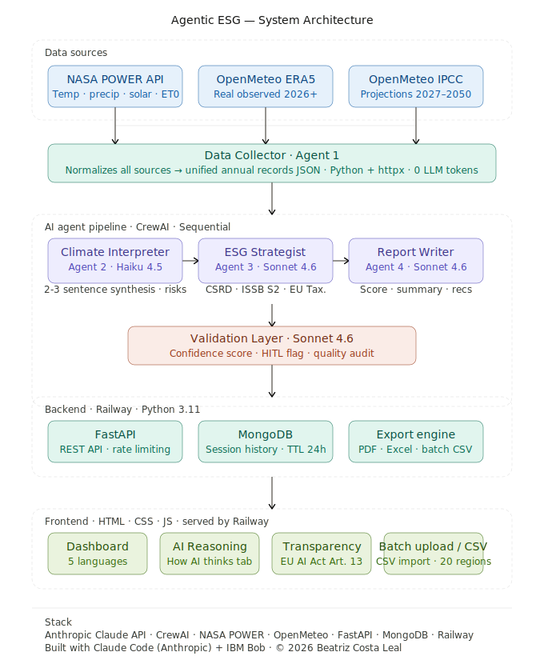

# Agentic ESG — Climate Risk Intelligence for ESG & Compliance

[](https://python.org)
[](https://fastapi.tiangolo.com)
[](https://crewai.com)
[](LICENSE)
[](https://railway.app)
[](https://github.com/PyCQA/bandit)
[](SECURITY.md)
[](SECURITY.md)

> Physical climate risk assessment powered by NASA satellite data, IPCC projections, and Claude AI agents.

📦 **GitHub:** https://github.com/BeatrizCoder/agentic-esg

---

## 🌐 Live Demo

**[agentic-esg-production.up.railway.app](https://agentic-esg-production.up.railway.app)**

> Try it: type any city name and get a full ESG climate risk analysis powered by real NASA data.

---

## Overview

Organizations face mounting regulatory pressure to assess and disclose physical climate risks under CSRD, ISSB S2, and EU Taxonomy. Traditional climate risk assessments cost $5,000–$50,000 and take weeks. Agentic ESG delivers executive-ready climate risk intelligence in under 30 seconds for ~$0.04 per location — powered by real NASA satellite data, ERA5 reanalysis, and IPCC projections to 2050.

> **Maps physical climate risk to CSRD ESRS E1, ISSB S2, and EU Taxonomy — translating satellite data into compliance-ready business intelligence.**

**Built for:** ESG analysts, sustainability officers, investment managers, and compliance teams who need fast, data-driven climate risk intelligence.

---

## Architecture



---

## The Problem

Organizations face mounting pressure to assess and disclose physical climate risks:

- **CSRD (Corporate Sustainability Reporting Directive)** — EU companies must report climate risks under ESRS E1 by 2024-2025
- **ISSB S2 (Climate-related Disclosures)** — Global standard requiring scenario analysis and physical risk assessment
- **EU Taxonomy** — Investment screening requires climate risk evaluation for sustainable finance classification
- **Traditional assessments** — Manual climate risk analysis costs $5,000-$50,000 and takes weeks

Agentic ESG delivers executive-ready climate risk assessment in under 30 seconds for ~$0.04 per location.

---

## How It Works

### The Pipeline (Sequential Agent Architecture)

```
Location Input (lat/lon)
        ↓
┌───────────────────────────────────────────────────────────┐
│ Agent 1: Data Collector (Python adapter — no LLM)        │
│   • NASA POWER API: 10 years real satellite data         │
│   • ERA5 reanalysis: current-year real observations      │
│   • OpenMeteo IPCC: Climate projections 2027-2050        │
│   • 5 parameters: temp, precip, solar, ET0, soil moist. │
└───────────────────────────────────────────────────────────┘
        ↓
┌───────────────────────────────────────────────────────────┐
│ Agent 2: Climate Analyst (Claude Haiku 4.5)              │
│   • Detects trends: warming rate, precipitation shifts   │
│   • Identifies anomalies: extreme years, heat stress     │
│   • Calculates risks: drought, flood, heat stress        │
└───────────────────────────────────────────────────────────┘
        ↓
┌───────────────────────────────────────────────────────────┐
│ Agent 3: ESG Strategist (Claude Sonnet 4.6)              │
│   • Maps risks to CSRD ESRS E1 articles                  │
│   • Evaluates ISSB S2 scenario requirements              │
│   • Assesses EU Taxonomy climate criteria                │
│   • Determines compliance urgency                         │
└───────────────────────────────────────────────────────────┘
        ↓
┌───────────────────────────────────────────────────────────┐
│ Agent 4: Report Writer (Claude Sonnet 4.6)               │
│   • Generates executive summary                           │
│   • Calculates physical risk score (0-100)               │
│   • Assigns investment status badge                       │
│   • Provides framework-specific recommendations          │
│   • Defines ecosystem offset targets                      │
└───────────────────────────────────────────────────────────┘
        ↓
┌───────────────────────────────────────────────────────────┐
│ Agent 5: Validation Layer (Claude Sonnet 4.6)            │
│   • Validates output coherence                            │
│   • Flags inconsistencies across agent outputs            │
│   • Assigns confidence score (0-100)                      │
└───────────────────────────────────────────────────────────┘
        ↓
    Final Report
```

### Data Sources

**NASA POWER API (1981–2025)**
- Real satellite observations from NASA's POWER project
- Daily resolution: temperature (T2M), precipitation (PRECTOTCORR), solar irradiance (ALLSKY_SFC_SW_DWN), FAO-56 evapotranspiration (ET0_FAO), soil moisture 0–10 cm (SOIL_MOISTURE_0_10CM)
- Global coverage at 0.5° × 0.5° resolution
- Aggregated to annual statistics for trend analysis

**OpenMeteo ERA5 (2026–present)**
- Real observed data from ECMWF ERA5 reanalysis for the current and recent years
- Bridges the gap between NASA POWER history and IPCC projections
- Same 5-parameter coverage as NASA POWER

**OpenMeteo IPCC Climate API (2027–2050)**
- IPCC AR6 climate projections using EC_Earth3P_HR model
- Three emissions scenarios: SSP1-2.6 (optimistic), SSP2-4.5 (moderate), SSP5-8.5 (high)
- Daily resolution: temperature, precipitation, evapotranspiration (ET0)
- Enables long-term risk forecasting across scenario space

### Agent Details

| Agent | Model | Role | Output |
|-------|-------|------|--------|
| **Data Collector** | Python + httpx | Fetches and normalizes climate data | Annual records (temp, precip, solar, ET0, soil moisture) |
| **Climate Analyst** | Claude Haiku 4.5 | Detects trends and anomalies | Risk levels, key findings, data quality |
| **ESG Strategist** | Claude Sonnet 4.6 | Maps risks to compliance frameworks | CSRD/ISSB/Taxonomy exposure + urgency |
| **Report Writer** | Claude Sonnet 4.6 | Generates executive report | Risk score, summary, recommendations |
| **Validation Layer** | Claude Sonnet 4.6 | Validates output coherence, flags inconsistencies | Confidence score (0-100) |

---

## Key Features

### Risk Assessment
- **Physical Climate Risk Score (0-100)** — Quantitative measure of location-specific climate exposure
- **Investment Status Badge** — Approved / Conditioned / Restricted / Suspended (based on risk thresholds), translated in all 5 languages
- **Risk Level Classification** — Low / Medium / High / Critical
- **Trend Analysis** — Temperature, precipitation, and ET0 changes per decade
- **Anomaly Detection** — Identifies extreme years (hottest, driest, wettest)

### Enhanced Climate Data (5 Parameters)
- **Temperature** — Mean annual (T2M) from NASA POWER satellite observations
- **Precipitation** — Total annual (PRECTOTCORR), corrected for systematic bias
- **Solar Radiation** — Surface shortwave downwelling (ALLSKY_SFC_SW_DWN, kWh/m²/day)
- **Evapotranspiration (ET0)** — FAO-56 Penman-Monteith reference ET; ET0/precipitation ratio > 1.3 flagged as HIGH water deficit (CSRD ESRS E3-4)
- **Soil Moisture** — 0–10 cm layer (m³/m³); declining trend flags long-term desiccation risk

### Three-Source Climate Timeline
- **NASA POWER** — Verified historical observations 1981–2025
- **OpenMeteo ERA5** — Real observed data 2026–present (ECMWF reanalysis)
- **OpenMeteo IPCC** — Climate projections 2027–2050 (SSP1-2.6, SSP2-4.5, SSP5-8.5)
- Unified visualization showing all three sources with clear source labels

### ESG Compliance Mapping
- **CSRD ESRS E1** — Article-level mapping (E1-1 through E1-9) with exposure assessment
- **ISSB S2** — Scenario analysis requirements and disclosure recommendations
- **EU Taxonomy** — Climate adaptation criteria evaluation (Annex I, Appendix A)
- **Double Materiality Assessment** — Impact and financial materiality per CSRD ESRS 1
- **Compliance Urgency** — Low / Medium / High / Critical priority classification

### Batch Analysis
- **CSV Upload** — Analyze up to 20 regions in a single submission
- **Template Download** — Pre-formatted CSV with example rows (region, lat, lon, sector, scenario)
- **Sequential Processing** — 2-second delay between regions to respect NASA API rate limits
- **Results Table** — Risk score, risk level, investment status, and confidence for every region
- **Excel Export** — All batch results in a single formatted workbook, sorted by risk score

### ESG Glossary
- Bilingual EN/PT glossary of key ESG and climate terms
- Searchable: CSRD, ISSB S2, EU Taxonomy, Double Materiality, HITL, SSP Scenarios, and more

### AI Transparency Layer (EU AI Act Art. 13)
- **Risk Score Composition** — Weighted factor breakdown showing what drove the score
- **Agent Reasoning Chain** — What each agent received as input and what it concluded
- **Validation Audit Trail** — Per-check results from the Validation Layer
- **Interpretability vs Explainability** — Separated score factors from narrative reasoning

### Human-in-the-Loop Flag
- Automatic flag when Validation Layer confidence falls below 70%
- Triggers on: critical risk + low confidence, extreme data anomalies, data quality issues
- Recommends expert validation before use in regulatory filings or investment decisions

### Ecosystem Offsets
- **Science-Based Targets** — Reforestation, wetland restoration, mangrove protection
- **Quantified Requirements** — Hectares, carbon sequestration potential, biodiversity impact
- **Regional Adaptation** — Tailored to local ecosystem and climate conditions

### Multilingual Support
- English (EN), Portuguese / PT-BR (PT), Spanish (ES), French (FR), German (DE)
- All UI labels, risk badges, investment status, and the Analyze button translate dynamically
- Language preference saved in localStorage and restored on next visit

### Terms & Privacy
- Bilingual EN/PT Terms of Use and Privacy Policy (scroll-to-accept)
- Platform gated until both documents are accepted
- LGPD compliant session storage (anonymous 24h TTL cookies)
- © 2026 Beatriz Costa Leal

### User Experience
- **Session History** — MongoDB-backed analysis storage with cookie consent
- **Dark/Light Theme** — Automatic system preference detection + manual toggle
- **PDF & Excel Export** — Professional report generation with charts and tables
- **Interactive Map** — Leaflet.js map with click-to-analyze any location globally

---

## Tech Stack

### Backend
- **Framework:** FastAPI (Python 3.11)
- **AI Orchestration:** CrewAI (multi-agent framework)
- **LLM Provider:** Anthropic Claude (Haiku 4.5 + Sonnet 4.6)
- **HTTP Client:** httpx (async) with tenacity retry logic
- **Rate Limiting:** slowapi
- **Testing:** pytest with async support

### Data & APIs
- **Climate Data:** NASA POWER API v2.5 — temperature, precipitation, solar, ET0, soil moisture (free, no auth)
- **Recent Observations:** OpenMeteo ERA5 reanalysis — real observed data 2026+ (free, no auth)
- **Projections:** OpenMeteo IPCC Climate API — projections to 2050, 3 SSP scenarios (free, no auth)
- **Database:** MongoDB — hosted as a service on Railway (persistent volume, not ephemeral storage)

### Frontend
- **Stack:** Vanilla HTML/CSS/JavaScript (no framework)
- **Styling:** Custom CSS with glassmorphism effects
- **Charts:** Chart.js for data visualization
- **Maps:** Leaflet.js for interactive location selection

### Deployment
- **Backend:** Railway (Docker container)
- **Database:** MongoDB — hosted as a service on Railway (persistent volume, not ephemeral storage)
- **Frontend:** Served via FastAPI static files
- **Domain:** Custom domain via Railway

### Development Tools
- **Development Tools:** Built with Claude Code (Anthropic) for architecture and development. IBM Bob (watsonx Code Assistant) — AI assistant used for deployment configuration, documentation, and code review. Code architecture and business logic designed by Beatriz Costa Leal.
- **Version Control:** Git + GitHub
- **Environment:** WSL2 Ubuntu on Windows 11

---

## Auditability & Transparency

Agentic ESG is designed for auditability:

- **Data provenance:** NASA endpoint URL + OpenMeteo model identifier logged per analysis
- **Timestamp:** Exact analysis datetime recorded and stored
- **Agent execution trace:** Per-agent token consumption visible in the Data Sources tab
- **Confidence score:** Validation layer scores each output 0–100, flags inconsistencies
- **Session isolation:** Anonymous 24h TTL session cookies, LGPD compliant

All provenance data visible in the **Data Sources** tab of every analysis report.

---

## Cost Per Analysis

**~$0.04 per full analysis** (5 parameters + richer agent prompts)

| Agent | Model | Avg Tokens | Avg Cost |
|-------|-------|-----------|---------|
| Data Collector | Python (no LLM) | 0 | $0.000 |
| Climate Analyst | Haiku 4.5 | ~1,000 | $0.003 |
| ESG Strategist | Sonnet 4.6 | ~1,400 | $0.011 |
| Report Writer | Sonnet 4.6 | ~1,700 | $0.014 |
| Validation Layer | Sonnet 4.6 | ~1,100 | $0.009 |
| **Total** | | **~5,200** | **~$0.037** |

*Costs based on Anthropic pricing: Haiku $0.25/$1.25 per MTok (in/out), Sonnet $3/$15 per MTok (in/out)*

---

## Live Demo

[Link to be added after deployment]

**Try these locations:**
- São Paulo, Brazil: -23.5505, -46.6333
- Miami, USA: 25.7617, -80.1918
- Mumbai, India: 19.0760, 72.8777
- Amsterdam, Netherlands: 52.3676, 4.9041

---

## Architecture

### Adapter Pattern
The Data Collector (Agent 1) is a **pure Python adapter** — no LLM involved. It:
1. Fetches raw JSON from NASA POWER and OpenMeteo APIs
2. Normalizes data structures (handles missing values, unit conversions)
3. Aggregates daily observations into annual statistics
4. Serializes records into a compact JSON format for downstream agents

This design keeps data collection **fast, deterministic, and cost-free** (no LLM tokens).

### Sequential Agent Pipeline
Agents run **sequentially** (not in parallel) because each depends on the previous agent's output:
- Agent 2 needs normalized data from Agent 1
- Agent 3 needs climate findings from Agent 2
- Agent 4 needs both climate + compliance summaries
- Agent 5 validates the entire chain

**Total pipeline time:** ~25-30 seconds (including API calls)

### Token Optimization
- **Compact summaries:** Each agent receives only the fields it needs (not full raw data)
- **JSON serialization:** Structured output parsing with fallback to regex extraction
- **Silent execution:** CrewAI console output suppressed to avoid TTY errors on servers

---

## Limitations

### Projection Methodology
- **Linear extrapolation:** Future trends are calculated using linear regression on historical data
- **Not physics-based:** We use IPCC model outputs (EC_Earth3P_HR) but don't run climate simulations ourselves
- **Three scenarios available:** SSP1-2.6, SSP2-4.5, SSP5-8.5 — results vary significantly between scenarios
- **No extreme events:** Projections show gradual trends, not sudden shocks (hurricanes, wildfires)

### Data Quality
- **NASA POWER coverage:** Some remote regions have sparse satellite coverage
- **Missing values:** Handled via -999.0 fill value detection and exclusion
- **Spatial resolution:** 0.5° × 0.5° grid (~55km at equator) — not building-level precision
- **Temporal gaps:** Occasional missing days in NASA data (excluded from annual aggregates)

### System Limitations
- **No user authentication:** Current version uses session-based storage only (LGPD compliant)
- **No real-time updates:** Climate data refreshed when NASA/OpenMeteo publish new datasets
- **Batch cap:** CSV batch analysis limited to 20 regions per submission; larger portfolios require multiple uploads

### Compliance Disclaimer
Agentic ESG provides **decision support**, not legal advice. Organizations should:
- Validate findings with qualified ESG consultants
- Conduct site-specific assessments for critical infrastructure
- Review outputs with legal counsel before regulatory filings
- Use as one input in a broader due diligence process

---

## Setup and Installation

### Prerequisites
- Python 3.10+ (3.11+ recommended)
- MongoDB instance (local or Railway)
- Anthropic API key

### Installation

```bash
# Clone repository
git clone https://github.com/BeatrizCoder/agentic-esg.git
cd agentic-esg

# Create virtual environment
python3 -m venv venv
source venv/bin/activate  # On Windows: venv\Scripts\activate

# Install dependencies
pip install -r requirements.txt

# Install development dependencies (for testing)
pip install -r requirements-dev.txt

# Configure environment
cp .env.example .env
# Edit .env with your API keys:
#   ANTHROPIC_API_KEY=your_key_here
#   MONGO_URL=your_mongodb_connection_string
#   ALLOWED_ORIGINS=http://localhost:3000,https://yourdomain.com
```

### Running Tests

```bash
# Run all tests
pytest tests/ -v

# Run with coverage report
pytest tests/ --cov=src/cs --cov-report=html

# Run specific test file
pytest tests/test_nasa_adapter.py -v
```

### Running Locally

```bash
# Terminal 1: Backend
source venv/bin/activate
uvicorn src.aesg.backend:app --reload --port 8001

# Terminal 2: Frontend (if serving separately)
python -m http.server 8080

# Access at http://localhost:8001
```

### Environment Variables

| Variable | Required | Description |
|----------|----------|-------------|
| `ANTHROPIC_API_KEY` | ✅ | Claude API key from console.anthropic.com |
| `MONGO_URL` | ✅ | MongoDB connection string |
| `PORT` | No | Server port (default: 8001) |
| `ALLOWED_ORIGINS` | No | CORS origins (default: "*") |

---

## Project Structure

```
agentic-esg/
├── src/aesg/
│   ├── backend.py              # FastAPI app entry point
│   ├── agents/
│   │   ├── definitions.py      # 5 CrewAI agent definitions
│   │   ├── tasks.py            # CrewAI task factories
│   │   └── crews.py            # Crew orchestration + token tracking
│   ├── data/
│   │   ├── nasa_adapter.py     # NASA POWER API client
│   │   └── openmeteo_adapter.py # OpenMeteo IPCC API client
│   ├── pipeline/
│   │   └── orchestrator.py     # Sequential agent pipeline
│   ├── api/
│   │   ├── routes.py           # FastAPI endpoints
│   │   └── models.py           # Pydantic request/response models
│   ├── db/
│   │   └── mongo.py            # MongoDB session storage
│   ├── exports/
│   │   └── pdf_report.py       # PDF generation
│   └── core/
│       └── config.py           # Environment variables
├── prompts/
│   ├── climate_analyst.md      # Agent 2 system prompt
│   ├── esg_strategist.md       # Agent 3 system prompt
│   └── report_writer.md        # Agent 4 system prompt
├── index.html                  # Frontend SPA
├── Dockerfile                  # Railway deployment
├── railway.toml                # Railway config
├── requirements.txt
└── README.md
```

---

## Deployment

### Railway (Recommended)

```bash
# Install Railway CLI
npm install -g @railway/cli

# Login and deploy
railway login
railway up

# Set environment variables in Railway dashboard
```

### Docker

```bash
# Build image
docker build -t agentic-esg .

# Run container
docker run -p 8001:8001 \
  -e ANTHROPIC_API_KEY=your_key \
  -e MONGO_URL=your_mongo_url \
  agentic-esg
```

---

## Quality Assurance

### Automated Testing
- **Unit tests** for NASA adapter and data processing
- **Integration tests** for API endpoints
- **Mock-based testing** for external API calls
- **GitHub Actions CI/CD** for automated testing on push

### Code Quality
- **Type hints** throughout codebase (Python 3.10+)
- **Pydantic validation** for all API inputs
- **Retry logic** for external API calls (tenacity)
- **Comprehensive error handling** with user-friendly messages
- **Configurable CORS** for production security

### Security Features
- Environment-based CORS configuration
- Rate limiting per IP address
- Input validation with Pydantic validators
- Session-based storage with TTL
- No hardcoded credentials

---

## License

Apache License 2.0

Copyright 2026 Beatriz Costa Leal

Licensed under the Apache License, Version 2.0 (the "License");
you may not use this file except in compliance with the License.
You may obtain a copy of the License at

    http://www.apache.org/licenses/LICENSE-2.0

Unless required by applicable law or agreed to in writing, software
distributed under the License is distributed on an "AS IS" BASIS,
WITHOUT WARRANTIES OR CONDITIONS OF ANY KIND, either express or implied.
See the License for the specific language governing permissions and
limitations under the License.

---

## Roadmap

**What's Already Implemented:**
- ✅ Batch location analysis (CSV upload — up to 5 regions)
- ✅ Three IPCC scenarios (SSP1-2.6, SSP2-4.5, SSP5-8.5)
- ✅ Multi-language support (EN, PT, ES, FR, DE)
- ✅ Evapotranspiration and soil moisture analysis
- ✅ Three-source climate timeline (NASA + ERA5 + IPCC)
- ✅ Human-in-the-Loop (HITL) validation flag
- ✅ AI Transparency layer (EU AI Act Art. 13)
- ✅ ESG Glossary (bilingual EN/PT)
- ✅ Terms of Use and Privacy Policy (scroll-to-accept)
- ✅ PDF and Excel export
- ✅ Session history with 30-day TTL (LGPD compliant)

**Near-term:**
- [ ] API key authentication for enterprise use
- [ ] Historical comparison mode (1980-2000 vs 2000-2020)
- [ ] Batch analysis expanded to 20 regions

**Medium-term:**
- [ ] Vector database for regulation knowledge base (ChromaDB)
- [ ] Custom sector risk profiles (agriculture, real estate, energy)
- [ ] Integration with GIS platforms (ArcGIS, QGIS)

**Long-term:**
- [ ] Physics-based climate models (WRF, RegCM)
- [ ] Extreme event probability modeling
- [ ] Portfolio-level risk aggregation
- [ ] Real-time monitoring and alerts

---

## Acknowledgments

**Data Sources:**
- NASA POWER Project (Prediction Of Worldwide Energy Resources)
- Open-Meteo IPCC Climate API
- IPCC AR6 Climate Models (EC_Earth3P_HR)

**Frameworks:**
- CrewAI by João Moura
- FastAPI by Sebastián Ramírez
- Anthropic Claude AI

**Development:**
- Built with Claude Code (Anthropic) — architecture, features, and business logic
- IBM Bob (watsonx Code Assistant) — AI assistant used for deployment configuration, documentation, and code review. Code architecture and business logic designed by Beatriz Costa Leal.
- Inspired by the "Become An Agentic Architect" course

**Security:**
- See [SECURITY.md](SECURITY.md) for security policy and best practices
- Report vulnerabilities to: biagenai24@outlook.com

---

*Built by Beatriz Costa — June 2026*  
*Open source for educational and research purposes*  
*Contact: biagenai24@outlook.com*
