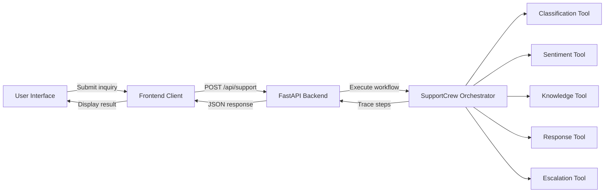
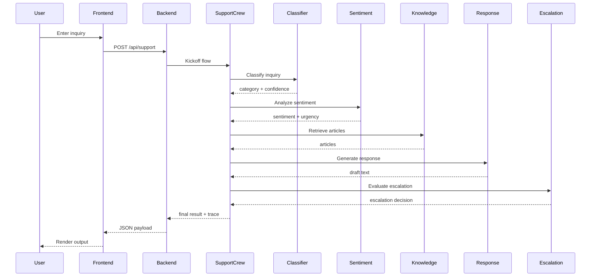

# System Architecture Document (SAD): AAMAD Multi-Agent Support MVP

**Project:** Agentic Customer Support System

**Version:** 1.0

**Date:** May 2, 2026

**Owner:** System Architect

**Status:** Build Phase

---

## 1. Executive Summary

AAMAD evolved from a local CLI prototype into a decoupled client-server MVP. The frontend now calls a FastAPI backend over HTTP. The backend orchestrates a deterministic multi-agent workflow with CrewAI-style agents, deterministic tools, collaboration logging, escalation rules, and structured JSON responses.

This design is intentionally LLM-free for cost control, while preserving future extensibility for Azure/OpenAI integration behind feature flags.

## 2. Scope

| Scope | Description |
| --- | --- |
| Primary | Customer-facing support via HTTP-backed frontend, handling inquiries, classification, sentiment, knowledge lookup, response generation, escalation decisions |
| Secondary | Internal escalation guidance, observability of agent workflow, local frontend fallback when backend unavailable |
| Out of scope | Production deployment, databases, real LLM inference, enterprise CRM integration |

## 3. Key Architectural Decisions

- **Client-server separation**: Frontend and backend are decoupled through a REST API.
- **Deterministic orchestration**: Backend workflow uses rule-based tools instead of LLMs today.
- **Observability**: Response payload includes a `steps` trace of tool and agent interactions.
- **Config-driven agents**: Agent metadata and goals are loaded from `config/agents.yaml`.
- **Safe future LLM integration**: Architecture supports future feature flags for Azure/OpenAI.

## 4. Architecture Overview

### 4.1 High-Level Architecture

### 4.2 Component Summary

- **Frontend (`src/aamad/frontend.py`)**
  - CLI interface with optional backend mode.
  - Local fallback behavior when backend is unavailable.
  - Displays category, sentiment, response, escalation state, and workflow history.

- **Backend (`src/aamad/backend.py`)**
  - FastAPI service exposing `/api/support` and `/health`.
  - Orchestrates CrewAI `SupportCrew` and `SupportFlow`.
  - Returns structured `SupportResponse` with `steps`.

- **SupportCrew**
  - Instantiates agents from config.
  - Attaches deterministic tools to each agent.
  - Logs each tool execution and collaboration event.

- **SupportFlow**
  - Sequences classification, sentiment, knowledge retrieval, response generation, and escalation.
  - Uses `@start` and `@listen` decorators to model stage transitions.

- **Tools**
  - `ClassificationTool`: Category detection and confidence.
  - `SentimentTool`: Sentiment and urgency detection.
  - `KnowledgeTool`: Category-based article retrieval.
  - `ResponseTool`: Template-based response generation.
  - `EscalationTool`: Human escalation decision rules.

## 5. System Flow

### 5.1 Request Flow

### 5.2 Workflow Behavior

- Processing is deterministic and sequential.
- Each tool writes a trace entry to `steps`.
- `ask_agent()` and `delegate_task()` create collaboration metadata even when actions are simulated.
- Escalation logic includes explicit request keywords, low confidence, and sensitive sentiment.

## 6. Technology Stack

- Python 3.9+
- FastAPI
- CrewAI (`Agent`, `Flow`, `start`, `listen`)
- `pydantic`
- `pyyaml`
- Optional Streamlit frontend

## 7. Visual Design Notes

The document style now follows a structured SAD format with:
- Section headers for clarity
- Tables for scope and decisions
- Mermaid diagrams for architecture and flow
- Bullet summaries for component responsibilities

This makes the architecture easier to scan and keeps the implementation aligned with the actual backend/frontend split.

## 8. Future Enhancements

- Add feature-flagged Azure/OpenAI support for LLM-powered responses.
- Add persistent ticket history and analytics storage.
- Add richer browser UI and live agent trace visualization.
- Harden API security and add authentication.
- Replace rule-based tools with semantic retrieval and adaptive orchestration.
